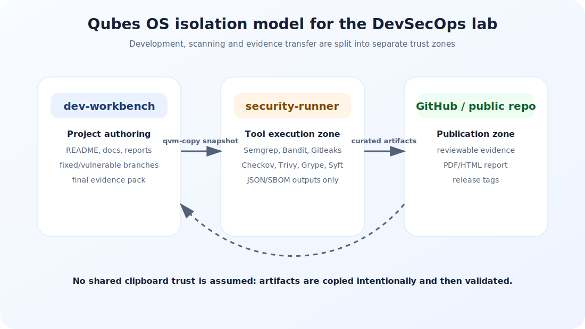
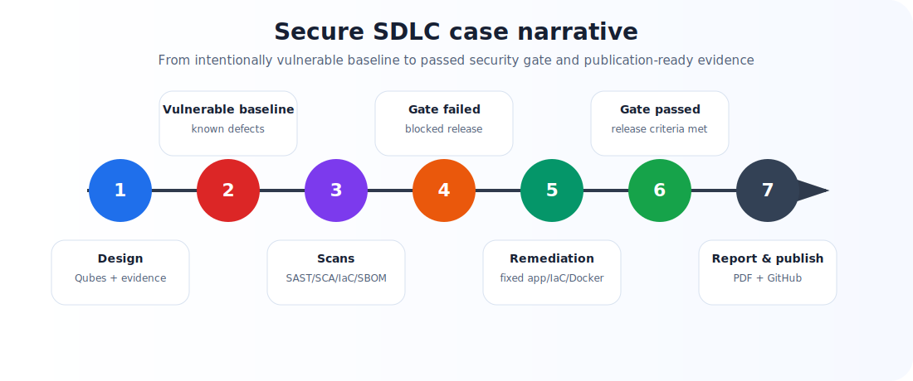
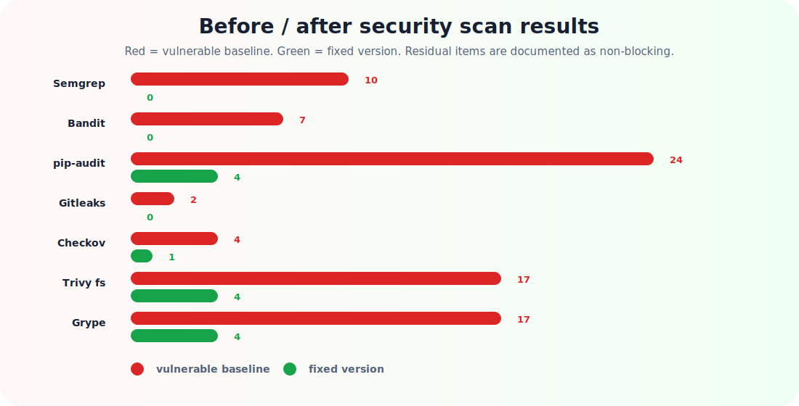
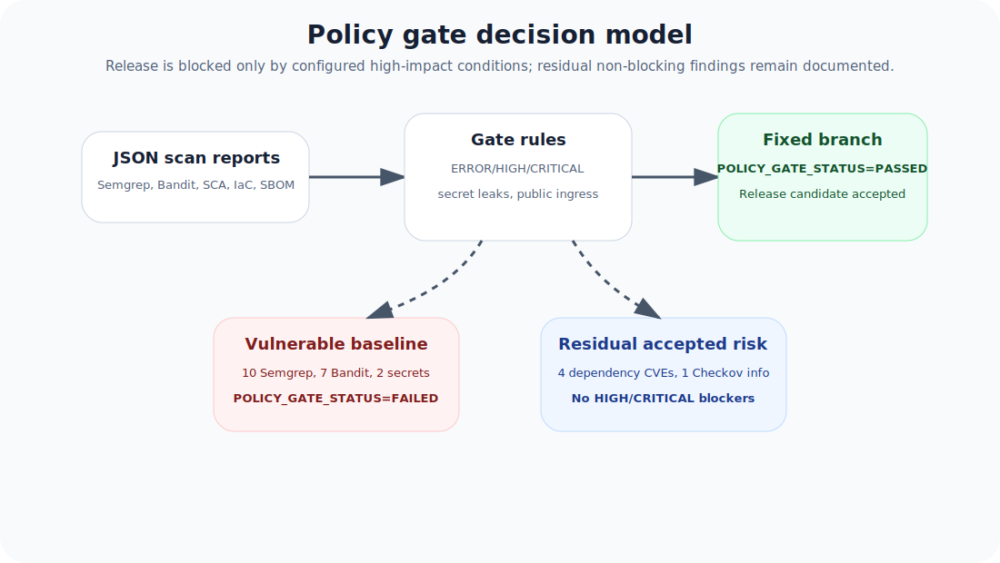
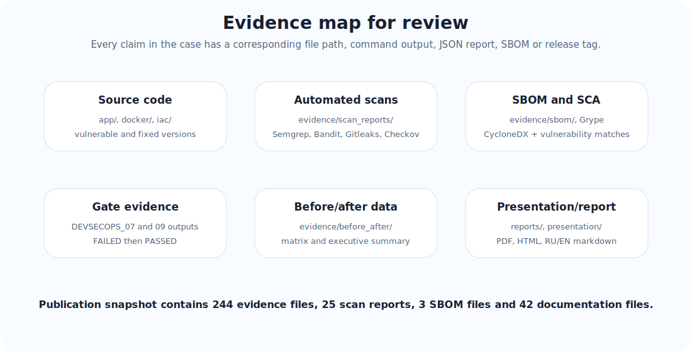

# Qubes Secure SDLC / DevSecOps Lab — final technical report

**Status:** the project objective has been achieved.  
**Final result:** the vulnerable baseline fails the security gate, while the remediated version passes the security gate and is ready for GitHub publication.  
**Environment:** Qubes OS, separated dev-workbench and security-runner qubes, evidence stored under `evidence/`.

> **Main takeaway:** this is a complete Secure SDLC case: design, vulnerable baseline, automated security checks, failed policy gate, remediation, repeated validation, SBOM, evidence pack, report and presentation.

## 1. What to review first

| Item | Location | Purpose |
| --- | --- | --- |
| Project landing page | `README.md`, `README_RU.md`, `README_EN.md` | quick navigation and artifact overview |
| This report | `reports/devsecops_lab_report_en.pdf` and `reports/devsecops_lab_report_en.html` | complete case explanation, diagrams, results and conclusion |
| Russian report | `reports/devsecops_lab_report_ru.pdf` | Russian-language review version |
| Presentation | `presentation/devsecops_case_defense.html` | slide-based project defense |
| Evidence inventory | `evidence/EVIDENCE_INVENTORY.csv` and `evidence/EVIDENCE_SUMMARY.md` | evidence index and validation files |
| Failed gate | `evidence/command_outputs/DEVSECOPS_07_OUTPUT_policy_gate_failed.txt` | vulnerable baseline is blocked |
| Passed gate | `evidence/command_outputs/DEVSECOPS_09_OUTPUT_policy_gate_passed.txt` | fixed version is accepted |
| Before/after | `evidence/before_after/DEVSECOPS_09_BEFORE_AFTER_SECURITY_SUMMARY.csv` | remediation comparison |
| Publication audit | `evidence/command_outputs/DEVSECOPS_13_OUTPUT_publication_completeness_audit.txt` | publication completeness check |

## 2. Qubes OS architecture

The project is intentionally structured as an isolated lab workflow rather than a single local folder with scanners. Authoring and documentation are handled in `dev-workbench`; scanner execution and external database downloads are handled in `security-runner`; results are copied back as controlled artifacts.

This separation matters for a DevSecOps case: scanners receive source code and pull external vulnerability databases, but the main authoring environment remains separated from scanner cache, temporary files and network-heavy activity.

## 3. Secure SDLC scenario

The case is built as a release story. A deliberately vulnerable baseline is created first. It is scanned with multiple security tools and blocked by a policy gate. Then the remediated version is created, scanned again and allowed by the same gate logic.

Key milestones are recorded as git tags:

| Tag | Meaning |
| --- | --- |
| `v1.0-vulnerable-baseline` | vulnerable app, Dockerfile and IaC |
| `v1.1-policy-gate-failed` | evidence that the gate blocks the baseline |
| `v1.2-remediation` | remediated app, dependencies, Dockerfile and IaC |
| `v1.3-policy-gate-passed` | evidence that the gate passes after remediation |
| `v1.4-evidence-pack` | evidence inventory and checksums |
| `v1.5-report` | technical report |
| `v1.6-presentation` | presentation package |
| `v1.7-publication-ready` | GitHub publication readiness |
| `v1.8-final-publication` | final publication-ready snapshot |

## 4. Vulnerable baseline

The baseline intentionally includes realistic security issues that commonly appear in software delivery pipelines:

| Area | Example risk | Tooling |
| --- | --- | --- |
| Python application security | insecure coding patterns | Semgrep, Bandit |
| Secrets management | test secrets committed to source | Gitleaks |
| Dependency risk | vulnerable Python dependencies | pip-audit, Trivy, Grype |
| Docker hardening | insecure container configuration | Trivy Dockerfile |
| Infrastructure as Code | unsafe ingress and weak settings | Checkov, Trivy IaC |
| Supply chain evidence | lack of formal component inventory | Syft SBOM, Grype |

The secrets are demonstration values, but they are intentionally detected as a real risk category. This keeps the case close to a real DevSecOps workflow.

## 5. Before / after results

| Tool | Baseline | Fixed | Outcome |
| --- | --- | --- | --- |
| Semgrep SAST | 10 | 0 | 0 ERROR after remediation |
| Bandit Python SAST | 7 | 0 | 0 HIGH after remediation |
| pip-audit SCA | 24 | 4 | 4 residual, not gate-blocking |
| Gitleaks secrets | 2 | 0 | secrets removed |
| Checkov IaC | 4 | 1 | 1 residual CKV2_AWS_5 |
| Trivy fs | 17 | 4 | 0 HIGH/CRITICAL |
| Grype SBOM | 17 | 4 | 0 HIGH/CRITICAL |

Gate-relevant counters:

| Gate condition | Baseline | Fixed |
| --- | ---: | ---: |
| Semgrep ERROR | 5 | 0 |
| Bandit HIGH | 2 | 0 |
| Gitleaks findings | 2 | 0 |
| Trivy fs HIGH/CRITICAL | 6 | 0 |
| Trivy Dockerfile HIGH/CRITICAL | 1 | 0 |
| Grype HIGH/CRITICAL | 6 | 0 |

## 6. Policy gate

The policy gate does more than collect reports. It makes a release decision based on predefined blocking conditions. This is what turns the case into a DevSecOps pipeline rather than a set of unrelated scans.

The vulnerable baseline records the expected result:

**`POLICY_GATE_STATUS=FAILED`**

The remediated version records the expected result:

**`POLICY_GATE_STATUS=PASSED`**

Residual findings are not hidden. They are explicitly documented as non-blocking residual risk:

| Residual item | Value | Why it does not block |
| --- | ---: | --- |
| pip-audit total vulnerabilities | 4 | no configured HIGH/CRITICAL blocker remains in the final policy |
| Checkov failed checks | 1 | `CKV2_AWS_5`: security group is not attached in a demo IaC module |
| Public ingress `0.0.0.0/0` | 0 | the main network exposure risk is removed |
| Grype HIGH/CRITICAL | 0 | no high-impact SBOM risk remains |

## 7. Evidence map

The project includes verifiable evidence: command outputs, JSON reports, SBOM files, before/after CSV files, screenshots and checksums.

The final publication control recorded:

| Category | Count |
| --- | ---: |
| Evidence files | 244 |
| Scan report files | 25 |
| SBOM files | 3 |
| Report files | 11 |
| Documentation files | 42 |

## 8. Objective coverage

The goal was to build a strong portfolio-ready Secure SDLC / DevSecOps case in Qubes OS. The key deliverables have been met:

| Requirement | Status | Evidence |
| --- | --- | --- |
| Isolated workflow | done | dev-workbench, security-runner, qvm-copy evidence |
| Vulnerable baseline | done | `app/vulnerable-version`, `docker/vulnerable.Dockerfile`, `iac/vulnerable` |
| Remediated version | done | `app/fixed-version`, `docker/fixed.Dockerfile`, `iac/fixed` |
| Automated security scans | done | `evidence/scan_reports/` |
| SBOM | done | `evidence/sbom/DEVSECOPS_09_SBOM_fixed_syft_cyclonedx.json` |
| Failed gate | done | `POLICY_GATE_STATUS=FAILED` |
| Passed gate | done | `POLICY_GATE_STATUS=PASSED` |
| Before/after comparison | done | `evidence/before_after/` |
| Report and presentation | done | `reports/`, `presentation/` |
| GitHub publication readiness | done | `GITHUB_PUBLICATION_NOTE.md`, `RELEASE_CHECKLIST.md`, release tags |

## 9. Limitations

This is a controlled training lab. Some infrastructure objects are not deployed to a real AWS account. That is intentional: the goal is to demonstrate Secure SDLC, evidence discipline and gate logic rather than production infrastructure operations.

Residual findings remain visible in the reports instead of being erased from history. That is a strength of the case: it shows mature differentiation between blocking and non-blocking risk.

## 10. Conclusion

The project is ready for review and publication. It demonstrates the full path from a vulnerable baseline to a remediated version with a passed security gate, and includes verifiable artifacts, a visual report, a presentation and clear reviewer navigation.

**Answer to the main question: yes, the assignment objective has been achieved.**
